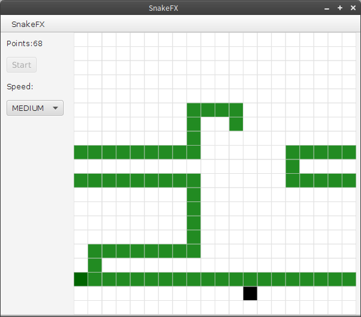

# SnakeFX
This is a clone of the old mobile phone game "Snake".
It was created as an example project to learn *JavaFX*.

The object of the game is simple: You are controlling a snake that likes to eat
food. Every time the snake eats some food it grows a little bit. You may not bite yourself in the tail or you are game over. There are no walls in this game so when you move outside of one side of the screen you appear again on the other side of the screen.

### Build the game
The game is coded in Java version 8 so you will need to have Java 8 installed to be able to build the project. 
The project is based on the build system [gradle](http://http://www.gradle.org/). 

To build the project type `gradle build`. To run the application you can type `gradle run`.

### Create Executables

A runnable JAR can be created with `gradle shadowJar`. The JAR file is then located under `build/libs/colorpuzzlefx-all.jar`. 

